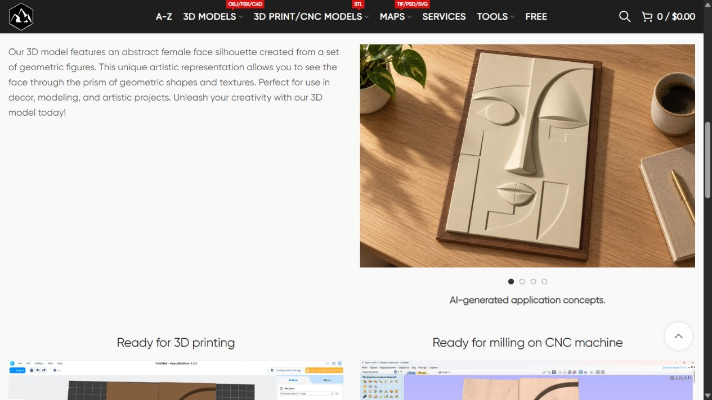

# Финальные два STL — Release Report

Дата: 2026-10-08 17:42 МСК. External WordPress, https://shustrik-maps.com.

По запросу следующих пяти свежая сверка оставила только два допустимых необработанных товара. Оба опубликованы и проверены в согласованном объёме; дальнейшую проверку переключения слайдов владелец взял на себя.

| Товар | ID | Опубликованные media |
| --- | --- | --- |
| [Moon Surface](https://shustrik-maps.com/product/moon-surface-3d-model/) | 16743 | 22795, 22796, 22797, 22798 |
| [Abstract Female Face Silhouette](https://shustrik-maps.com/product/abstract-female-face-silhouette-3d-model/) | 16812 | 22799, 22800, 22801, 22802 |

## Отбор и семантика

Каталог 516 опубликованных товаров, 186 с явным STL format icon. После этой партии допустимых необработанных STL **0**. Belarus9512 исключён владельцем; Denmark9516 ранее обработан, см. [[../Ten More Global STL Sliders 2026-10-07/Release Report]]. C4D-only товары с конверсией по запросу не подставлялись. [[remaining-stl-audit.json]].

Google, English, USA параметры hl=en/gl=us/pws=0; фактическая локация выдачи Unknown. Moon surface/lunar terrain STL: цифровые платные модели, рядом free generators/NASA/globes/game terrain. Abstract female face relief STL: цифровые decorative relief/CNC модели, рядом bust/free sculpture. Измеренные частотности, позиции и difficulty не получены. [[semantic-review.json]], [[intent-evidence.json]], [[google-moon-surface.txt]], [[google-female-face.txt]], [[Page Briefs]].

## Изменения и сохранность

Изменены только SEO title/meta и первый illustration-блок Description. У Moon заменён один woodmart_image16744. У Female Face заменена только illustration-only section16813; исходный introductory paragraph сохранён дословно и расположен рядом со слайдером. Все остальные исходные тексты, excerpts, H1, URLs, specs, цены, файлы/downloads, верхние галереи, sample renders, Internet ideas galleries, internal links, payment/shared HTML blocks сохранены. Сравнение всех protected postmeta хэшей также прошло. 19 прежних media из baseline сохранены, старые иллюстрации не удалены. [[baseline.json]], [[after.json]], [[preservation-qa.json]].

Созданы8 native ImageGen концептов по собственным4 product references. Каждый результат осмотрен: desktop ivory plastic/solid full backing; small wall relief; gift box; large grey concrete panel. Moon — квадратный lunar tile; Female — высокая прямоугольная geometric face panel, без bust. У Female исходная Base: Open сохранена, сплошная подложка концепта — дополнительная fabrication. PNG originals/prompts/references сохранены. Настоящие RGB JPEG1500×1000; AI title/alt/caption, SHA256. [[jobs.json]], [[native-registry.json]], [[visual-review.json]], [[uploaded-media.json]].

Слайдер: один слайд desktop/mobile, четыре изображения, ручные стрелки и точки, без autoplay/wrap. Под ним только жирная центрованная AI-generated application concepts.

## Проверки

- Guarded DB/SEO/content/protected data:2/2; media metadata/MIME/dimensions/hash:8/8.
- Public HTTP/cache-bypass SEO title/meta/H1/canonical/indexability/Product schema/cart/raw-shortcodes/short notice:4/4; media HEAD200/image/jpeg:8/8. [[public-qa.json]], [[verify.json]].
- Backup matches original baseline2/2; guarded rollback-preview2/2. [[backup-export.json]], [[rollback-preview.json]].
- До уточнения владельца Moon Surface:4slides×desktop/mobile=8, Next/Previous/dots passed. Female Face переключение не проверялось по прямому указанию владельца: «Проверять переключение слайдов на компьютере и телефоне не нужно. Я это сделаю сам». Скриншот первого опубликованного слайда сохранён. [[browser-scope.json]].
- WireGuard SSH/sudoDocker available; WP/DB running, restart0, StartedAt иports before/after совпали. WP127.0.0.1:8083; DB безpublished ports. Build/restart/local runtime changes нет. [[server-runtime-before.txt]], [[runtime-before.txt]], [[runtime-after.txt]].

## GitHub, точный source и откат

GitHub-first fetch/prune/main/origin, source baseline2dfe29da75253c69a1aa026a1ec1fea37d883c90, upstream0:0. Прежние unrelated dirty/untracked сохранены; staged только новая release-folder. Published source **e57e600bd818973ed469613fbde1cce5aec3e0f2** pushed. Exact git archive SHA256 **27bdc056d09d97225e1437332657ad71c468f909596bb3363325d78d84c973b9**, local/VPS hashes совпали, PHP lint прошёл. [[github-first.json]], [[deployment.json]]. Apply выполнен один раз; предыдущие release.php не запускались.

Durable WordPress options _shustrik_final_two_stl_slider_backup_20261008_16743 и _shustrik_final_two_stl_slider_backup_20261008_16812, соответствующие media journals. Полный экспорт before/after сохранён отдельно. Проверка и откат только при отсутствии последующих изменений:

    ssh vpsadmin@10.66.66.1 "sudo -n docker exec shustrik-maps-wordpress-1 php /tmp/final-two-stl-e57e600/release.php --rollback-preview"
    ssh vpsadmin@10.66.66.1 "sudo -n docker exec shustrik-maps-wordpress-1 php /tmp/final-two-stl-e57e600/release.php --rollback"

Rollback восстанавливает прежние Description/SEO, media не удаляет. Повторный apply не идемпотентен, запрещён без разбора фактического состояния.

## Следующие действия

Новых допустимых необработанных STL нет. Владелец проверит переключения слайдов. P1 analytics/recovery/consent, index check10.10, yellow/degraded сохранены; mesh/readiness/accuracy/production rights не проверялись и новыми обещаниями не заменялись.

