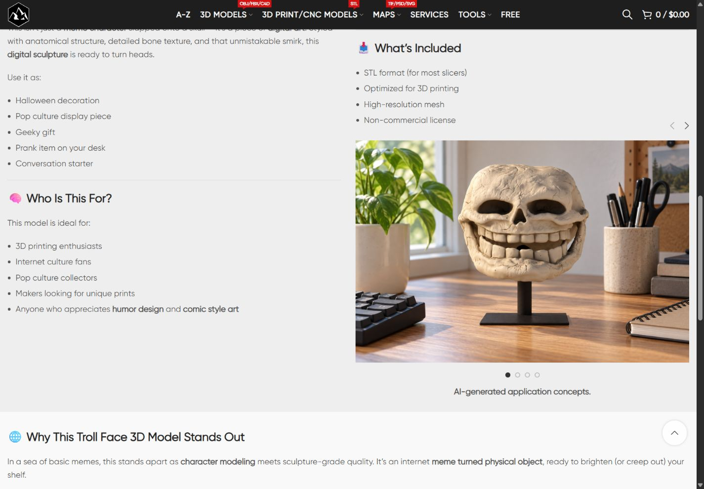

# Пять STL: модели и лунные кратеры

Опубликованы SEO title/meta description и20 новых JPEG1500×1000 в пяти собственных слайдерах. Исходные основные тексты сохранены дословно; H1/URL/excerpt/specs/commerce/prices/download files/верхние галереи и общие HTML-блоки сохранены.

| Товар | ID | Новые media |
|---|---:|---|
| [Sheikh Zayed 3D Model](https://shustrik-maps.com/product/sheik-zayed-3d-model/) | 15527 | 22775, 22776, 22777, 22778 |
| [Troll Face 3D Model for 3D Printing](https://shustrik-maps.com/product/troll-face-3d-model/) | 20192 | 22779, 22780, 22781, 22782 |
| [Zombie Monster Storage Box 3D Model](https://shustrik-maps.com/product/zombie-monster-box-3d-model/) | 20199 | 22783, 22784, 22785, 22786 |
| [Copernicus Lunar Crater 3D Model](https://shustrik-maps.com/product/copernicus-lunar-crater-3d-model/) | 16696 | 22787, 22788, 22789, 22790 |
| [Theophilus Lunar Crater 3D Model](https://shustrik-maps.com/product/theophilus-lunar-crater-3d-model/) | 16728 | 22791, 22792, 22793, 22794 |

## Проверка

DB/SEO5/5, защищённые поля5/5; media20/20: MIMEimage/jpeg,1500×1000, original-byteSHA256, title/alt с AI-концептом, HTTP200. Public10/10: обычный и QA-query URL, title/meta/H1/self-canonical/indexability/Product schema/cart CTA/нет raw VC-shortcodes/только жирная центрованная AI-подпись. Browser40/40: четыре слайда каждого товара, desktop1440×1000/mobile390×844; один видимый загруженный слайд, стрелки2, точки4, Next/Previous/first-last dots10sets, autoplay=no/wrap=no, без horizontal overflow. Все10screens осмотрены.

Сохранены40 прежних верхних media; прежняя иллюстрация Sheikh15536 также существует (title/URL/fileSHA проверены). Для кратеров прежние sample renders и Internet ideas gallery сохранены, заменена только первая standalone illustration16705/16730. Старые media не удалялись. Всего20 оригинальных native ImageGen PNG, промпты и10 собственных SKU refs сохранены рядом с отчётом и в двух release-папках GitHub. Каждый результат осмотрен: desktop полностью на сплошной опоре, отдельные части закреплены; изображения являются концептами, а не mesh verification. Zombie wall/gift coral glasses описаны в alt; Troll сохраняет исходный stand.

## Источники и семантика

Google, English, hl=en/gl=us/pws=0; фактическая локация Unknown. Сохранены7 запросов и full snapshots. Кластеры редакционные; частотности, позиции и US ranks не измерялись. Bust отделён от Mosque/другого Sheikh; Troll skull от плоского meme/physical/free; Zombie box от game organisers; lunar relief от Moon globe/Mars/free NASA/game terrain. Новые accuracy/readiness/license обещания не добавлены. Исходные размеры Sheikh76×48×68m и прежние production/research claims сохранены для отдельной валидации. Troll original non-commercial license сохранён; AI exhibition не предоставляет коммерческих прав. [[Page Briefs]], [[Intent Review]], [[Scope Correction]], [[../Next Lunar Sliders 2026-10-08/Page Briefs]].

Первоначальный отбор пропустил4 STL-icon товара; вывод о трёх оставшихся исправлен. Партия завершена пятью реальными STL-товарами. В свежем каталоге516 published products; необработанные подтверждённые STL: Moon Surface16743 и Abstract Female Face Silhouette16812. Belarus9512 исключён владельцем; Denmark9516 уже обработан по [[../Ten More Global STL Sliders 2026-10-07/Release Report]], повторно не менялся.

## GitHub и external runtime

GitHub-first: origin SSH/main, fetch/prune, исходныйHEAD85b0692, upstream0:0; прежние unrelated dirty/untracked сохранены, staging ограничен двумя новыми release-папками. Source commits:

- `d2bf7c04f0ad077ebc4280bc5248c355bb1e05fc`, WP path`/tmp/next-models-d2bf7c0`, archiveSHA256`fc838939a331925a441d1b60e2a270418870e0c65b82e26ef7a901ed179b0f97` совпал local/VPS; PHP lint и preview прошли, apply выполнен один раз.
- `a785368d7163127fd1927f5c7757156315a37a4b`, WP path`/tmp/next-lunar-a785368`, archiveSHA256`e784b28a4db3717f1d5c9a83bad5774c80ece2278bbc2785dac1675ae8132bba` совпал local/VPS; PHP lint и preview прошли, apply выполнен один раз.

Промежуточный lunar source ceb6a125ca07c7c66c478df610ec59997585cf15 не публиковался: preview остановил неверный excerpt hash из-за locale-decoding NBSP. Фактические excerpts не менялись; исправлен явный UTF-8 decode, новый source a785368 прошёл preview. Публикация не повторяется после evidence commit.

WireGuard SSH vpsadmin@10.66.66.1 и sudoDocker available. WP/DB running,restart0, StartedAt/port bindings before-after совпали: WP127.0.0.1:8083, DB безpublished ports. Без build/restart и без изменения local runtime. `runtime-before.txt`/`runtime-after.txt`, `deployment.json`, `preservation-qa.json`, `final-five-qa.json`, `catalog-audit.json`. P1 analytics/recovery/consent, index check10.10, yellow/degraded сохранены; другие проекты не проверялись.

## Backup и rollback

Сохранены исходные baseline, durable per-product WordPress options с before/after и media journal, экспорт backups рядом с каждой release-папкой. Rollback-preview3/3 и2/2 прошли после публикации. Откат выполняется отдельно для двух непересекающихся групп; старые и новые media сохраняются. Перед rollback снова выполнить соответствующий preview; он блокирует drift и защищает owner edits.

```sh
sudo -n docker exec shustrik-maps-wordpress-1 php /tmp/next-models-d2bf7c0/release.php --rollback-preview
sudo -n docker exec shustrik-maps-wordpress-1 php /tmp/next-models-d2bf7c0/release.php --rollback
sudo -n docker exec shustrik-maps-wordpress-1 php /tmp/next-lunar-a785368/release.php --rollback-preview
sudo -n docker exec shustrik-maps-wordpress-1 php /tmp/next-lunar-a785368/release.php --rollback
```

`--apply` повторно не запускать. Если /tmp исчезнет, восстановить точный source archive из GitHub, сверитьSHA, затем preview. Option prefixes `_shustrik_next_models_stl_slider_backup_20261008_` и `_shustrik_next_lunar_stl_slider_backup_20261008_`; media journals с тем же scope.


